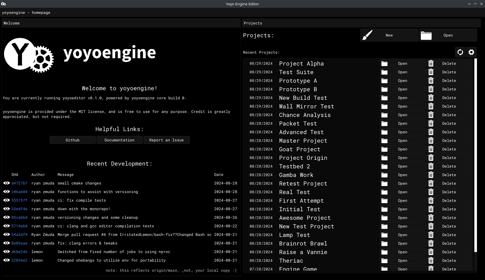
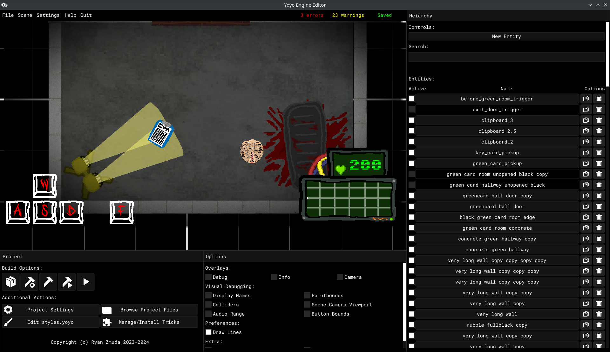
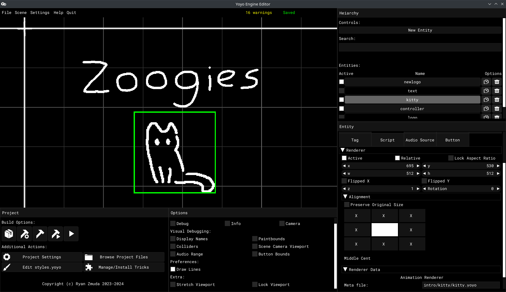
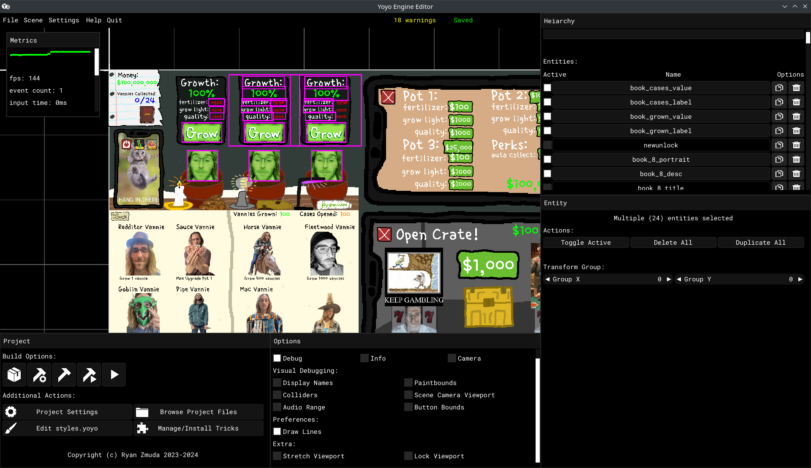

# Yoyo Engine Editor

This is the home of yoyoeditor, the official visual editor for [yoyoengine](https://github.com/yoyoengine/yoyoengine) games!

## Screenshots

<table class="full-width-table">
  <tr>
    <td></td>
    <td></td>
  </tr>
  <tr>
    <td></td>
    <td></td>
  </tr>
</table>

## Installation

The easiest way to obtain the editor is to **head over to the [yoyoengine hub](https://github.com/yoyoengine/launcher)** and follow the installation instructions to get the latest release.

The hub lets you install and manage multiple editor versions at once.

Be aware, **the editor is only supported on linux at this time!**

## Useful Resources

- The [documentation website](https://yoyoengine.github.io)
