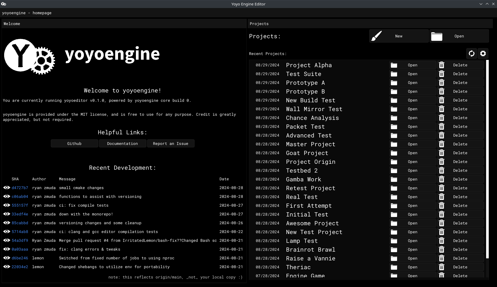
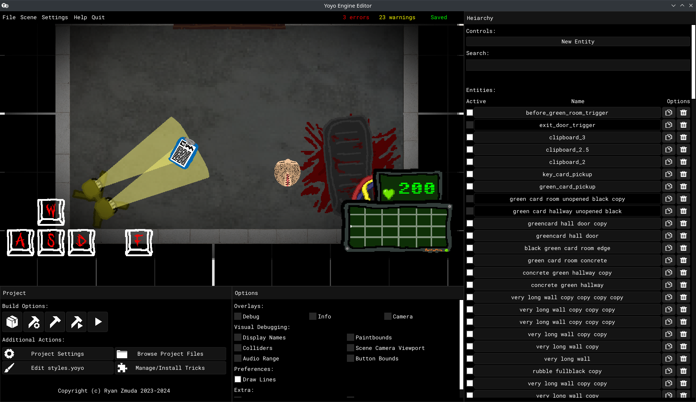
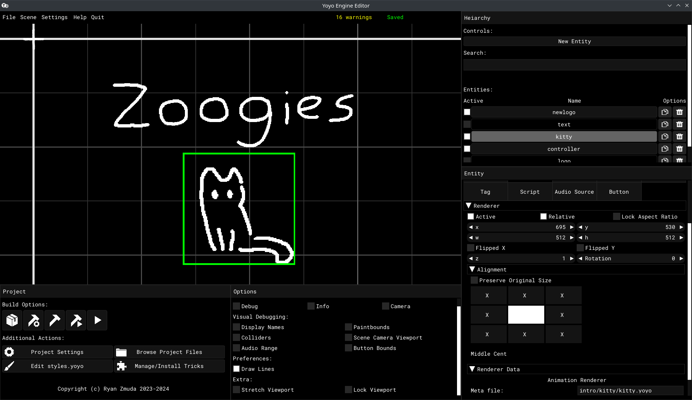
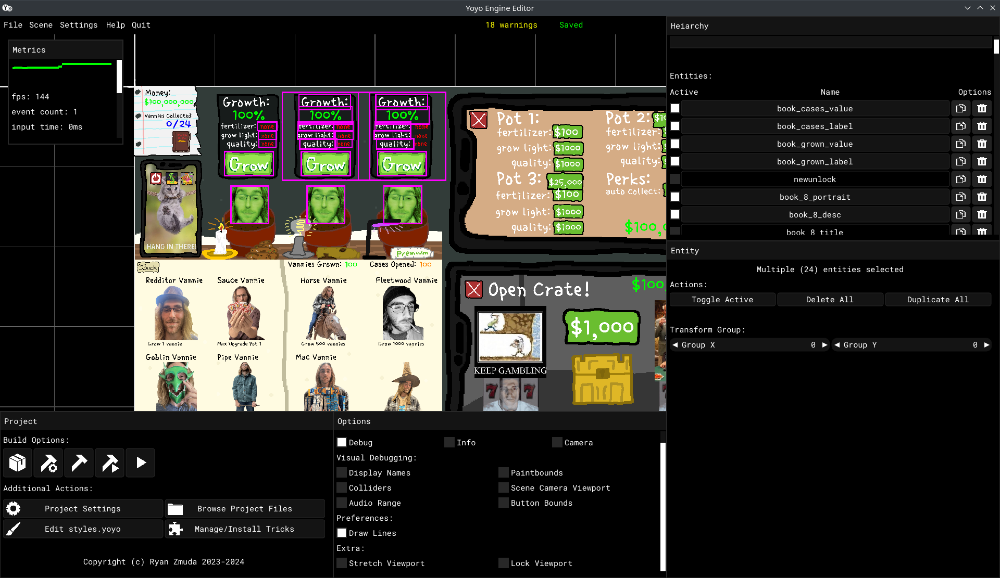

# Yoyo Engine Editor

This is the home of yoyoeditor, the official visual editor for [yoyoengine](https://github.com/yoyoengine/yoyoengine) games!

## Screenshots

<table class="full-width-table">
  <tr>
    <td></td>
    <td></td>
  </tr>
  <tr>
    <td></td>
    <td></td>
  </tr>
</table>
